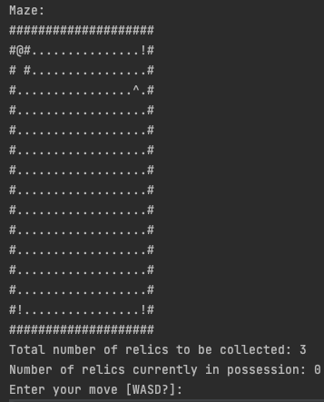
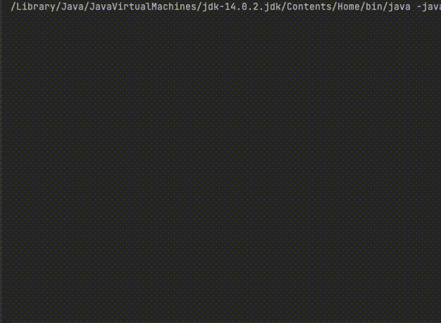

# Treasure Hunter

- You are the treasure hunter (`@`) and you are trying to find the treasure (`^`) hidden in the maze.

- The treasure is guarded by 3 guardians  (`!`) moving around the maze, so be careful not to get kill by them

- The maze is randomly generated by Prim algorithm
    - [Check out the wiki here for Prim algorithm](https://en.wikipedia.org/wiki/Maze_generation_algorithm#Randomized_Prim's_algorithm)

## Gameplay

- You can move the treasure hunter with these direction
    - `w` - move up
    - `s` - move down
    - `a` - move left
    - `d` - move right

- Special keys for help 
    - `?` - shows the help page for instructions
    - `m` - display the entire map

- When the game begins, the maze is hidden from the player

- As the treasure hunter moves through the maze, the maze will slowly revealed itself.

- When you got the relic, the next relic will unreveal itself somewhere random in the maze.
- Once you find all 3 treasures, you will win the game